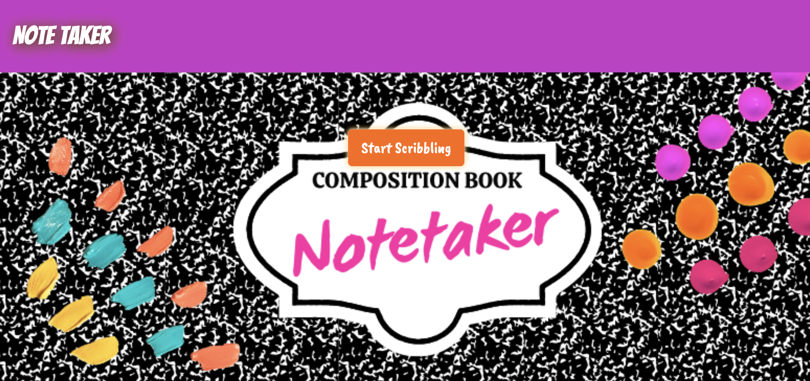
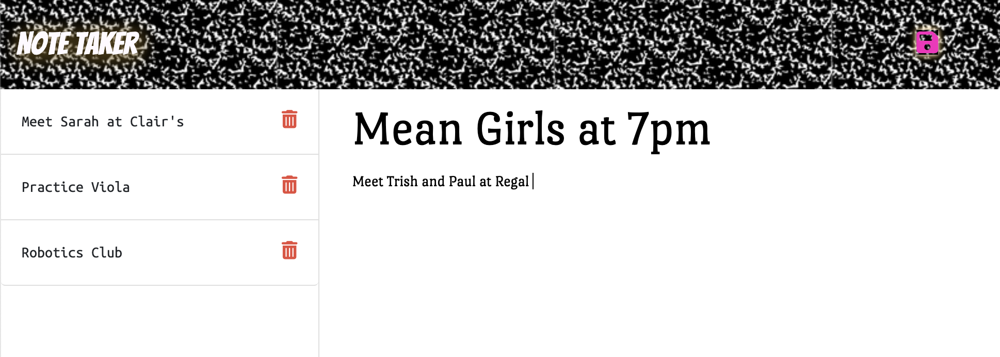

# Composition Book Notetaker

This app was inspired by a time before apps were a thing. Forget about having to find your only working gel pen, Composition Book Notetaker helps a student figure out their schedule so figuring themselves out might be just a little bit easier.  

## Table of contents
* [Technologies](#technologies)
* [Mockup](#mockup)
* [Resources-used](#resources-used)
* [Possible-improvements](#possible-improvements)
* [Github-url](#github-url)
* [Deployed-url](#deployed-url)

## Technologies

This website was created with starter code and a modge podge of technologies including Node.js, JavaScript, Boostrap, CSS, Express, and Heroku.

*February 2023 Update*
This application has been moved to Render hosting.

## Mockup

Here's a couple of screenshots from the Composition Book Notetaker app:

## Resources-used

* <a href="https://medium.com/@abdishire15/what-is-the-difference-between-fs-writefile-and-fs-writefilesync-3a2c3f2c516" target="_blank"> A Learning Assistant sent this to me to read and I scrolled through it. </a> 

* <a href="https://expressjs.com/en/starter/basic-routing.html" target="_blank"> This was helpful for implementing the delete route. </a> 

* <a href="https://devcenter.heroku.com/articles/git" target="_blank"> I visited the Heroku docs to refresh my memory on how to deploy to Heroku. </a> 

*February 2023 Update*
* <a href="https://www.youtube.com/watch?v=MusIvEKjqsc" target="_blank"> I needed to move this project to a free hosting service and Brad Traversy was a big help in learning about Render hosting and how to deploy to it! </a> 

## Possible-improvements

It's silly, but I very much wanted to change the colors of the trash can icons and I could not figure it out. 

The responsiveness of the homepage could be better.

---

## Github-url
<a href=https://github.com/AmyShafer/Composition-Book-Notetaker target="_blank_">Composition Book Notetaker Repository</a> 

## Deployed-url
<a href="https://composition-book-notetaker.onrender.com/" target="_blank_">Composition Book Notetaker URL</a> 

